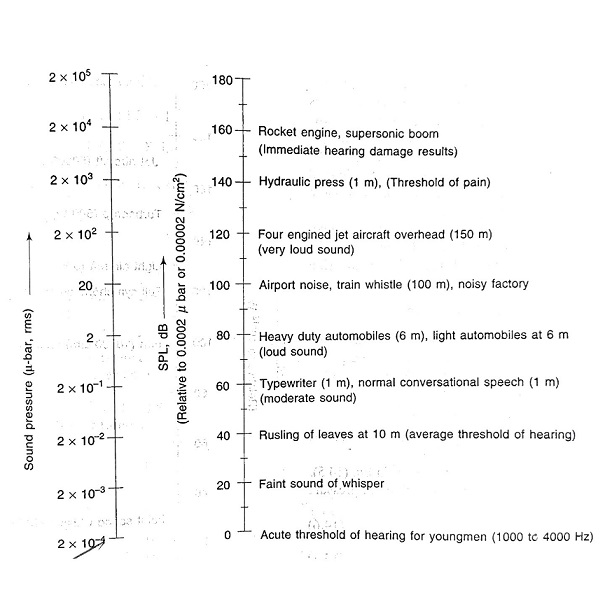
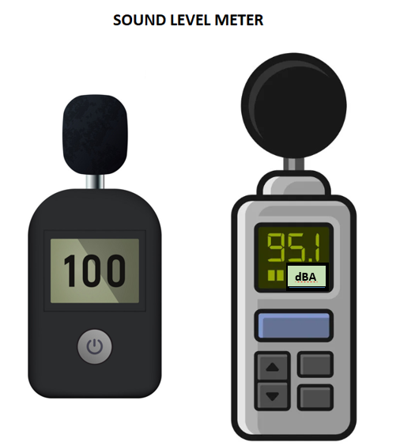

### Theory
Sound waves or acoustic pluses are vibrations that consist of a succession of rapid variations in air pressure, usually of a small magnitude. These are transmitted through the fluid (liquid or gaseous medium) and produce the sensation of hearing in the hearing meachanism. Sound forms an important part of man's environment. In some ways, it is quite useful to us. It makes speech communication possible, warns a person of danger, enables a person to enjoy music, etc. However, much of the sound one encounters unfortunately is unwanted sound termed noise. Some of the detrimental effects of noise are that excessive noise causes irritation, distraction or annoyance i.e., it hurts people psychologically and physiologically and tends to reduce man's efficiency. Further, it interferes with the communication between people and tends to mask audible warning signals thereby reducing the safety in workshops. In addition, prolonged exposure to noise can cause noise-induced hearing loss.

### Characteristics of Sound
Sound is characterised by the following parameters: 
- its intensity in W/m² or its pressure in ubar, 
- its frequency in cycles per second or Hz,
- the nature of noise which may be either continuous or impulsive,
- its loudness or loudness level, and
- its noise rating which is also called annoyance rating based on the sound pressure level and frequency.

### Sound Level Meter
Sound pressure levels are measured by sound level meters, which convert acoustic pressure into a directly proportional voltage indicated on a meter. The meter is positioned at the desired location with no obstruction from the sound source and the reading is taken. The block diagram of the instrument is shown in figure below. This includes a microphone, an electronic amplifier with frequency weighting network and a meter or recorder calibrated in decibels.
A rectifier circuit is incorporated to produce a signal proportional to root mean square value. The input signal generated by the sound pressure alternates from positive to negative levels. This signal is squared, which has the effect of producing all positive signals varying in amplitude. By taking the square root of this signal, it is possible to obtain the output of the meter in the form of averaged root mean square value of the signal.

The frequency response of the unweighted system is generally flat or linear over the entire available range from 20 Hz to 20 kHz. Further, some commercially available instruments have the upper frequency measuring range of approximately 30 kHz. The results of the measurements using the linear response are quoted in dB or dB linear.
A frequency weighting network is used in the circuit to provide a response similar to that of the human ear. With the network, there is a different amount of amplification for each frequency so that the overall measurement made gives greater emphasis to some frequencies than to others. It is seen from the equal loudness contours that the ear is more responsive to frequencies between 500 and 5000 Hz than to those above or below these frequencies. The weighting networks, therefore allow greater amplification in this range, than at higher or lower frequencies. Three standard weighting networks A, B and C are used to approximate the equal loudness curves. The response of the A scale approximates to 40 phon equal loudness curve and is used for SPL below 53 dB. Results of measurements made with this scale are expressed as dB A or dB 4. The B scale is used in the range 55-95 dB and the response approximates to the 70 phon equal loudness curve. The C scale, intended for use above 85 dB has approximately a flat response, except at the two ends.

